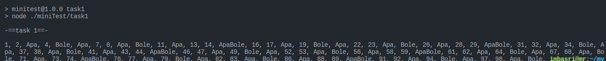

<h4>how to run it</h4>

<ol>
<li>Open your terminal or command prompt.</li>
<li>Type git clone https://github.com/imbasri/miniTest.git
</li>
<li>
Open folder with your text editor.
</li><li>
Start to edit and development.

-  "npm run start" run all
-  "npm run task1"
-  "npm run task2"
</li>
</ol>

<table>
Task1

 

Task2

</table>
